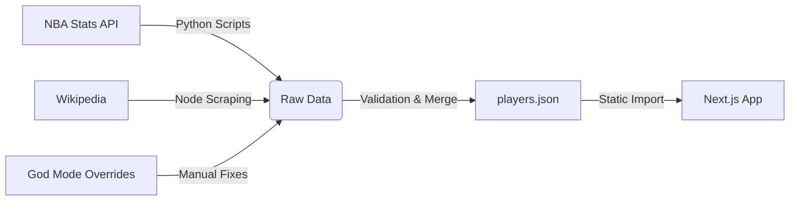

# 🏀 Swish Tac Toe | High-Performance NBA Trivia Game

 
 


**Swish Tac Toe** est une application web interactive de type "Immaculate Grid" développée avec une architecture moderne et performante. Ce projet démontre l'intégration de données complexes (NBA Stats API) dans une interface utilisateur fluide et réactive.

🔗 **Demo Live** : [swish-tac-toe.vercel.app](https://swish-tac-toe.vercel.app) *(insérer lien si dispo)*

## 🎯 Vision du Projet

L'objectif était de créer une expérience de jeu **sans latence** capable de valider des milliers de combinaisons possibles en temps réel. Le défi technique principal résidait dans la gestion d'un dataset massif (historique complet de la NBA, transferts, stats) tout en maintenant un bundle client ultra-léger.

## ✨ Fonctionnalités Clés

*   **⚡ Expérience Instantanée** : Zéro latence serveur pendant le jeu grâce à une base de données embarquée optimisée (Static Data Generation).
*   **🔍 Algorithme de Recherche Floue** : Système de recherche tolérant aux fautes de frappe et performant sur ~5000 joueurs.
*   **🧠 Logique de Jeu Complexe** : Validation matricielle dynamique (croisement Ligne x Colonne) gérant les cas limites (joueurs multi-équipes, échanges en milieu de saison).
*   **💾 Persistance Locale** : Sauvegarde automatique de la progression et historique des parties via `localStorage` (Offline-first approach).
*   **🎨 UI/UX Premium** : Design System cohérent "Dark & Neon", animations fluides (Framer Motion / CSS), et responsive design mobile-first.
*   **🌐 Internationalisation (i18n)** : Support complet FR/EN via React Context.

## 🛠️ Stack Technique & Décisions d'Ingénierie

### Frontend
*   **Framework** : [Next.js 14](https://nextjs.org/) (App Router) pour le SSR et l'optimisation des assets.
*   **Langage** : TypeScript strict pour la robustesse et l'autocomplétion.
*   **Styling** : Tailwind CSS pour une maintenabilité maximale et un bundle CSS purgé.
*   **Icons** : Lucide React.

## 🏗️ Architecture & Pipelines (ETL)

Le projet utilise un pipeline de données hybride pour garantir la fraîcheur et la précision des données sans sacrifier la performance du frontend.



1.  **Ingestion (Python)** : Des scripts cron interrogent l'API NBA pour récupérer les carrières, stats et awards.
2.  **Enrichissement (Node.js)** : Scraping des historiques de transferts pour gérer les cas complexes (joueurs ayant joué pour 5+ équipes).
3.  **Consolidation** : Fusion des données en un fichier JSON optimisé (~3MB) chargé au build-time pour une latence nulle en jeu.

## 📂 Arborescence du Projet

```bash
.
├── app/                  # Next.js App Router
│   ├── game/             # Logique principale du jeu (Grille)
│   ├── games/            # Historique des matchs (LocalStorage)
│   ├── stats/            # Tableau de bord analytique
│   ├── players/          # Base de données consultable
│   ├── guess/            # Mode de jeu "Devine le joueur"
│   └── layout.tsx        # Layout root (Fonts, Langues)
├── components/
│   ├── game/             # Composants spécifiques au jeu (Grid, Cells...)
│   ├── layout/           # Header, Footer, Ticker, Navigation
│   ├── providers/        # Context Providers (Theme, Language)
│   └── ui/               # Composants Shadcn UI réutilisables
├── hooks/                # Custom Hooks (useGameState, etc.)
├── lib/                  # Logique métier et Données (nba-data.ts, JSONs)
└── scripts/              # Outils ETL & Maintenance
    └── logs/             # Rapports d'exécution des scripts
```


## 🚀 Installation

### Prérequis

*   Node.js 18+
*   Python 3.9+ (pour les scripts de données)

### Pour commencer

1.  **Cloner le dépôt** :
    ```bash
    git clone https://github.com/binksterrel/swish-tac-toe.git
    cd swish-tac-toe
    ```

2.  **Installer les dépendances** :
    ```bash
    npm install
    ```

3.  **Lancer le serveur de développement** :
    ```bash
    npm run dev
    ```

4.  Ouvrez [http://localhost:3000](http://localhost:3000) dans votre navigateur.

## 📊 Gestion des Données

Le jeu repose sur un riche jeu de données situé dans `lib/players.json`. Nous utilisons plusieurs scripts pour garder ces données précises et à jour.

### Scripts Clés

*   **`scripts/fetch_awards.py`** :
    *   Un script Python qui itère sur la base de joueurs et récupère l'historique complet des récompenses (MVP, DPOY, All-Star, Titres, etc.) directement depuis l'API NBA Stats.
    *   *Usage* : `python3 scripts/fetch_awards.py`
    *   *Note* : Inclut une gestion du rate-limiting et une capacité de reprise (resume).

*   **`scripts/update-rosters-wiki-2024.js`** & **`2025.js`** :
    *   Scripts Node.js pour scraper les listes de transferts Wikipédia et appliquer les mouvements d'effectifs à la base de données.

*   **`lib/additional-nba-data.ts`** :
    *   Un fichier de surcharge manuelle ("God Mode") pour assurer la précision des données pour les superstars et gérer les cas particuliers que les API pourraient manquer.

## 🤝 Contribuer

Les contributions, problèmes et demandes de fonctionnalités sont les bienvenus !

1.  Forker le projet
2.  Créer votre branche de fonctionnalité (`git checkout -b feature/AmazingFeature`)
3.  Commiter vos changements (`git commit -m 'Add some AmazingFeature'`)
4.  Pusher vers la branche (`git push origin feature/AmazingFeature`)
5.  Ouvrir une Pull Request

## 📄 Licence

Distribué sous la licence MIT. Voir `LICENSE` pour plus d'informations.
